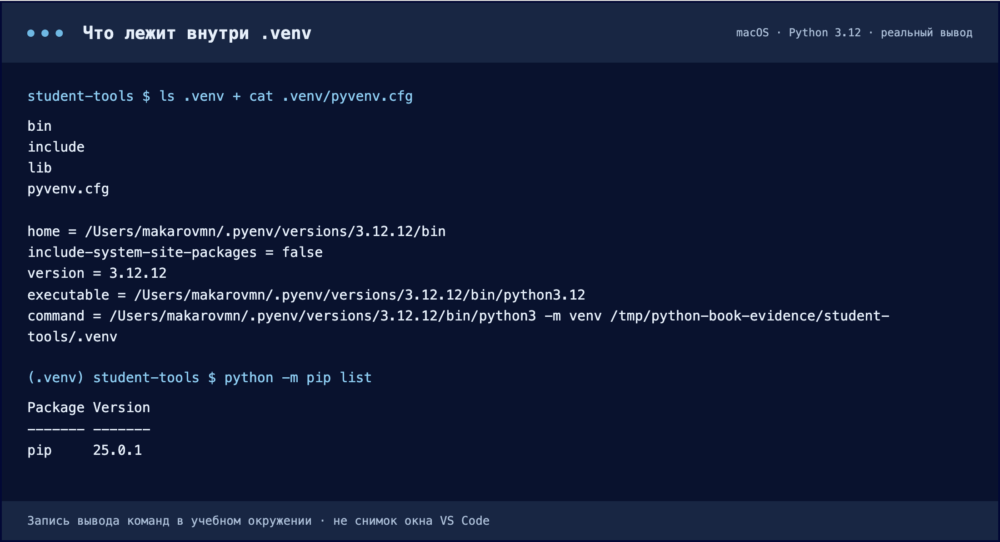
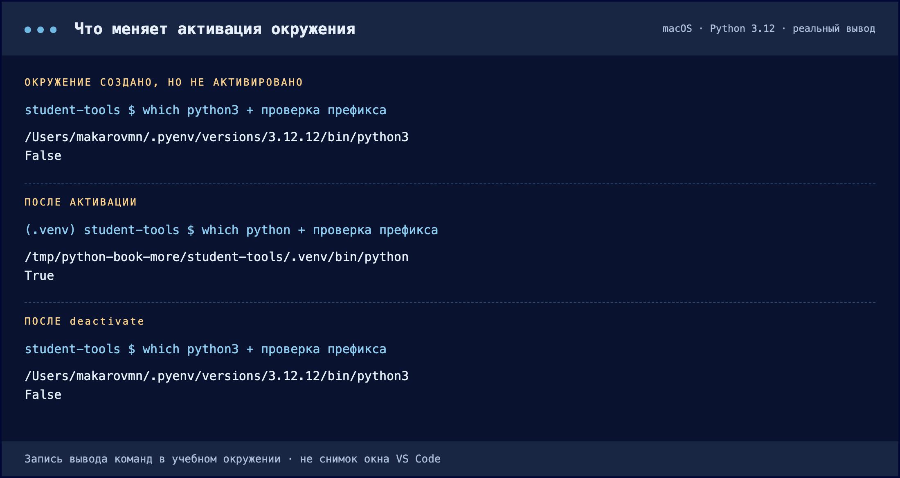
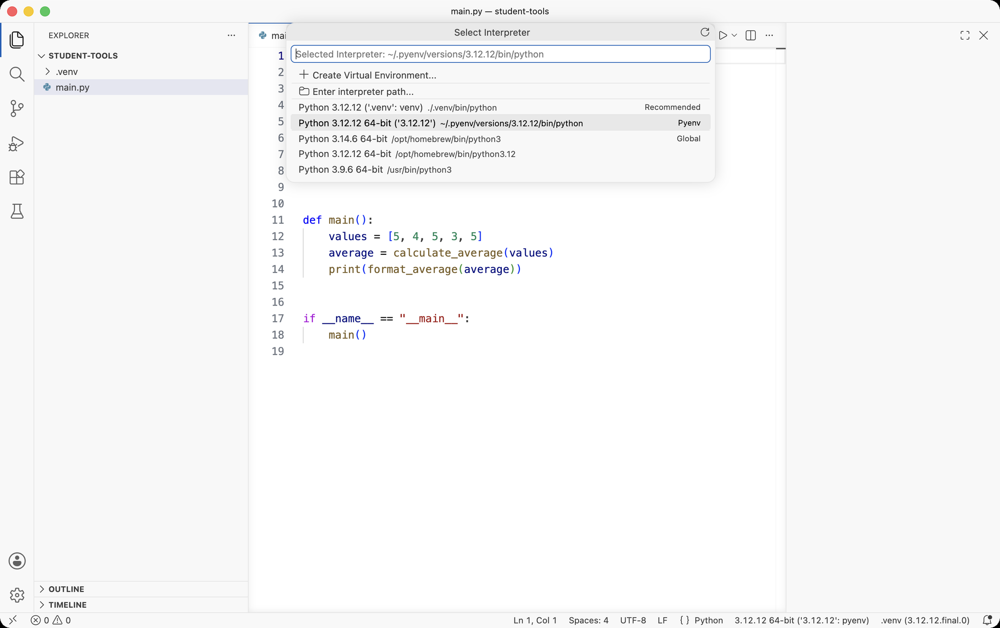
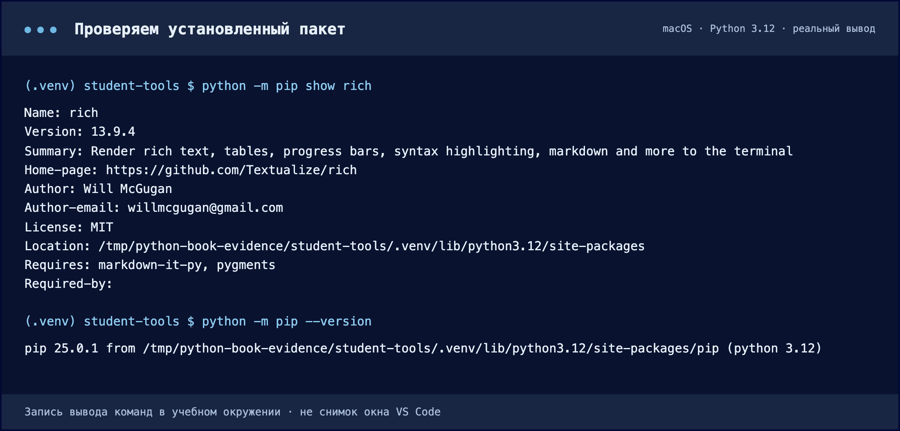
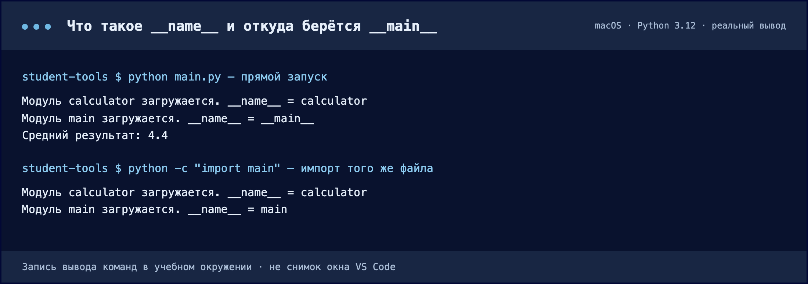
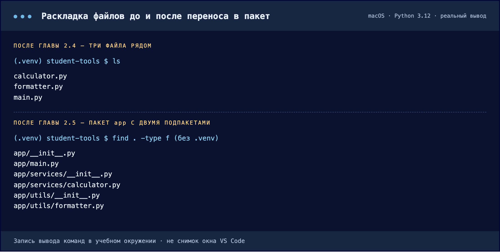
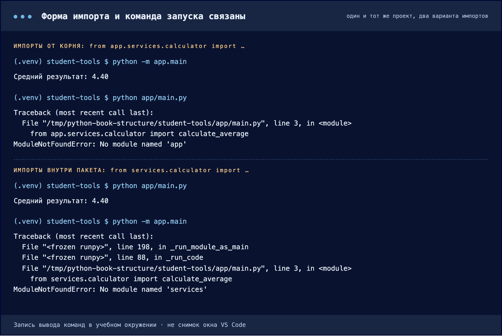
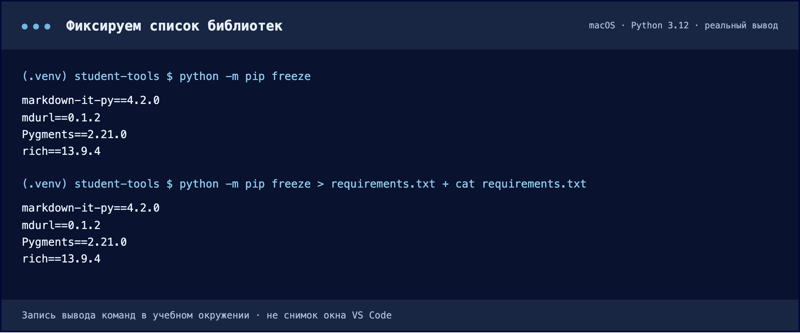
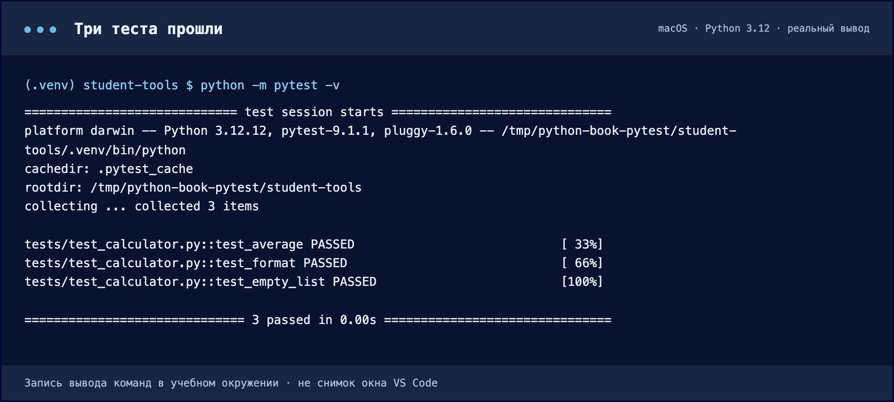

# Структура Python-проекта

**Проект** — это исходный код, тесты, документация, настройки и список зависимостей. В примере Student Tools программа считает среднюю оценку и выводит её через Rich.

## 2.1. Своё окружение

**Виртуальное окружение** отделяет библиотеки одного проекта от остальных. Разным проектам могут требоваться разные версии одной библиотеки.

Папка `.venv` создаётся на основе установленного Python. В ней находятся интерпретатор, служебные файлы и собственные пакеты. Это не отдельная операционная система. На Windows исполняемые файлы лежат в `Scripts`, на macOS/Linux — в `bin`. Файл `pyvenv.cfg` хранит настройки окружения.

Создание и активация — разные действия. Активация ставит папку с инструментами окружения в начало `PATH` только в текущем терминале. `deactivate` возвращает прежний порядок поиска, сохраняя папку и пакеты.

`sys.executable` показывает путь к выбранному Python. В окружении проверка `sys.prefix != sys.base_prefix` даёт `True`. Интерпретатор можно вызывать по полному пути без активации.

`.venv` — папка окружения, а `.env` обычно является файлом переменных окружения. Код проекта хранится отдельно от `.venv`.

## 2.2. Интерпретатор в VS Code

Редактор и терминал могут использовать разные Python. Если библиотека установлена в одном окружении, другой интерпретатор может её не увидеть.

Команда **Python: Select Interpreter** выбирает Python для редактора. Его путь и `sys.executable` в терминале должны указывать на одну `.venv`. Старый терминал после выбора может сохранить прежнее окружение.

В программе расчёт, оформление и запуск имеют разные обязанности. Аннотации `list[int]` и `float` описывают ожидаемые типы, но сами не проверяют данные. Формат `:.2f` оставляет два знака после точки. Для пустого списка средняя оценка не определена, поэтому возникает `ValueError`.

## 2.3. Зависимости

Стандартная библиотека, например `sys` и `pathlib`, поставляется с Python. **Зависимость** — библиотека, необходимая программе. Rich — сторонняя библиотека для оформления вывода в терминале.

**pip** — менеджер пакетов Python. По умолчанию он получает пакеты из каталога PyPI. Запись `python -m pip` запускает pip выбранным интерпретатором и помогает установить библиотеку в нужное окружение.

`pip show` показывает имя, версию и `Location` пакета, а `pip list` — установленные библиотеки. Изоляцию подтверждает путь `Location` внутри `.venv`: Rich может одновременно существовать и в базовом Python.

Rich меняет оформление вывода, а формула расчёта остаётся прежней. Вместе с библиотекой устанавливаются её собственные зависимости.

## 2.4. Модули и импорт

**Модуль** в этом примере — файл `.py`. Разделение по ответственности облегчает чтение и изменение программы: `calculator.py` считает, `formatter.py` оформляет строку, `main.py` соединяет шаги.

`import calculator` даёт доступ через имя модуля, а `from calculator import calculate_average` — через имя функции. Расширение `.py` в импорте не пишется. Импорт `*` скрывает происхождение имён.

При первом импорте выполняется код верхнего уровня. Определение функции создаёт её, а тело выполняется при вызове. Повторные импорты используют уже загруженный модуль из `sys.modules`.

У запущенного модуля `__name__` равно `"__main__"`, у импортированного — его имени. Условие `if __name__ == "__main__"` позволяет вызвать `main()` только при запуске. Определения функций и импорты остаются вне условия.

Имена модулей пишутся маленькими латинскими буквами с подчёркиваниями. Файлы `rich.py`, `json.py` или `random.py` могут затенить библиотеки. Встречные импорты создают циклы.

## 2.5. Пакеты и структура

**Пакет** объединяет связанные модули в папке. В пути `app.services.calculator` точки обозначают вложенность папок и модуль `calculator.py`.

| Часть проекта | Ответственность |
| --- | --- |
| `app/main.py` | Данные, вызов функций и вывод результата |
| `app/services/calculator.py` | Прикладной расчёт средней оценки |
| `app/utils/formatter.py` | Вспомогательное оформление строки |
| `tests/` | Проверки кода |
| `.venv/` | Локальный Python и установленные пакеты |

`__init__.py` объявляет обычный пакет и является его телом. При импорте вложенного модуля Python выполняет эти файлы по пути сверху вниз. В учебном проекте они пустые. Папки без файла тоже могут импортироваться как namespace packages.

`python -m app.main` находит модуль по имени и выполняет его как главный. При таком запуске из корня проекта пакет `app` виден в `sys.path`. При запуске `python app/main.py` первой папкой поиска становится `app`, поэтому импорты от корня могут не сработать.

**Структура** определяет расположение файлов, **архитектура** — обязанности и зависимости частей. Точка запуска использует расчёт и оформление. Эти модули не импортируют точку запуска: данные получают аргументами, результат возвращают через `return`.

## 2.6. Воспроизводимость и тесты

Окружение содержит локальные пути и платформенные файлы, поэтому `.venv` не передают другому разработчику. Передают исходники и описание зависимостей, а окружение создаётся заново.

`pip freeze` записывает установленные пакеты с версиями, включая косвенные зависимости. Список сохраняется в `requirements.txt`. Это снимок окружения, который не фиксирует версию Python и ОС и не является полноценным lock-файлом.

`.gitignore` исключает `.venv`, кэш `__pycache__`, файлы `*.pyc` и локальный `.env`. Уже отслеживаемые файлы правило не убирает. README объясняет назначение проекта, структуру, версию Python, установку, запуск и ожидаемый результат.

**Тест** вызывает функцию с известными данными и проверяет результат. pytest находит файлы `test_*.py` и функции `test_…`. `assert` проверяет условие, `pytest.approx` сравнивает дробные числа с допуском, а `pytest.raises` проверяет ожидаемую ошибку.

В Student Tools проверяются средняя оценка, оформление строки и ошибка для пустого списка. Тесты также проверяют правильность импортов из отдельной папки.

## 2.7. Порядок файлов и ошибки

Место файла определяется его ответственностью, а имена и папки должны соответствовать импортам. Запуск и тесты из нового окружения подтверждают, что проект не зависит от старой `.venv`.

- `No module named rich` — выбранный Python не видит библиотеку.
- `No module named app` — неверная рабочая папка, структура или способ запуска.
- `Cannot import name` и `partially initialized module` — возможны ошибка имени или циклический импорт.
- `collected 0 items` — тесты не найдены; это не подтверждает исправность программы.

Скриншоты взяты из урока и показывают macOS; пути на другом компьютере отличаются.

Источник: [«Структура Python-проекта», главы 2.1–2.7](https://algorthimization-course-vvodnoe.vercel.app/mdk0101-razrabotka-modulei/lessons/02-struktura-python-proekta/01-venv.html).
